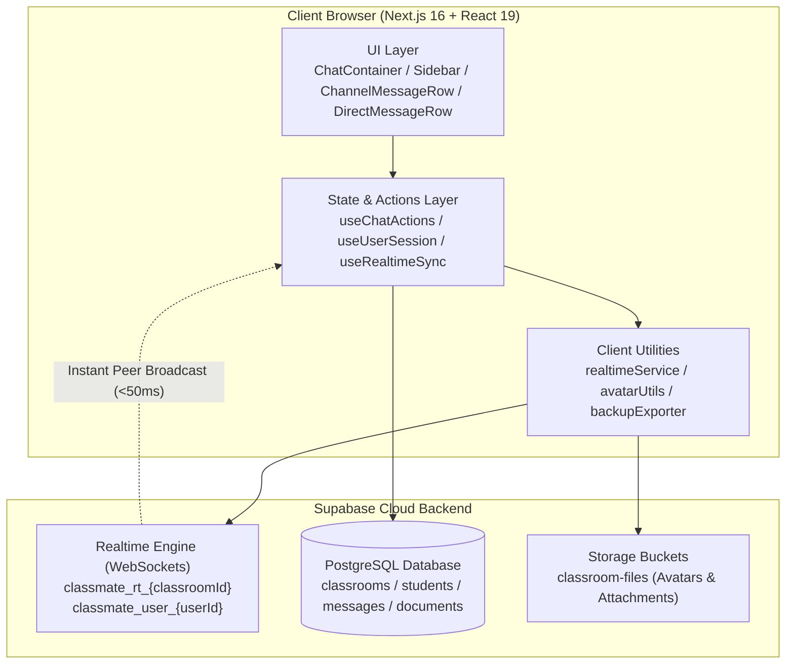

# Classmate — Academic Workspace & Campus Note Vault

> **A strictly private, closed-network academic workspace and real-time collaboration hub built exclusively for classrooms, study cohorts, and student communities.**

---

## 🏛️ System Architecture



---

## 📚 Master Documentation Index

All in-depth technical specifications, security audits, and database models are organized into dedicated documentation files under the **[`docs/`](docs/)** directory:

| Document | Focus & Scope | Key Raw Implementation Files |
| :--- | :--- | :--- |
| **[1. Authentication & Login](docs/AUTHENTICATION_AND_LOGIN.md)** | Student sign-in, Classroom Join Gate, Admin PIN gate, HMAC-SHA256 session tokens, and online/offline presence tracking. | [`src/hooks/useUserSession.ts`](src/hooks/useUserSession.ts)<br/>[`src/components/modals/JoinGateModal.tsx`](src/components/modals/JoinGateModal.tsx)<br/>[`src/lib/database/studentsDb.ts`](src/lib/database/studentsDb.ts) |
| **[2. Chat & Real-Time Sync Engine](docs/CHAT_AND_REALTIME_SYSTEM.md)** | `#general` social-media layout, 1-on-1 private DMs, WebSocket broadcasting, typing indicators, read receipts, and reactions. | [`src/hooks/useChatActions.ts`](src/hooks/useChatActions.ts)<br/>[`src/hooks/useRealtimeSync.ts`](src/hooks/useRealtimeSync.ts)<br/>[`src/lib/realtimeService.ts`](src/lib/realtimeService.ts)<br/>[`src/components/chat/ChannelMessageRow.tsx`](src/components/chat/ChannelMessageRow.tsx) |
| **[3. Message Deletion & Permissions](docs/MESSAGE_DELETION_AND_PERMISSIONS.md)** | "Delete for Me" vs "Delete for Everyone", database hard-deletion (`DELETE FROM messages`), CR moderation rules, and media cleanup. | [`src/lib/database/messagesDb.ts`](src/lib/database/messagesDb.ts)<br/>[`src/components/chat/DeleteMessageModal.tsx`](src/components/chat/DeleteMessageModal.tsx)<br/>[`src/components/chat/ClearChatModal.tsx`](src/components/chat/ClearChatModal.tsx) |
| **[4. Media, Avatars & Storage](docs/MEDIA_STORAGE_AND_AVATARS.md)** | Supabase Storage bucket uploads, animated GIF & image validation (anti-video gate), and real-time avatar sync across devices. | [`src/lib/avatarUtils.ts`](src/lib/avatarUtils.ts)<br/>[`src/components/modals/profile/AvatarPickerSection.tsx`](src/components/modals/profile/AvatarPickerSection.tsx)<br/>[`src/lib/database/classroomDb.ts`](src/lib/database/classroomDb.ts) |
| **[5. Security Architecture & Data Isolation](docs/SECURITY_AND_DATA_ISOLATION.md)** | Closed-room boundary, query-level DM isolation, cryptographic session tokens, zero telemetry, and auto-expiring messages. | [`src/lib/security/sessionSecurity.ts`](src/lib/security/sessionSecurity.ts)<br/>[`src/lib/database/messagesDb.ts`](src/lib/database/messagesDb.ts) |
| **[6. Database Schema & Data Models](docs/DATABASE_SCHEMA_AND_MODELS.md)** | PostgreSQL relational schema, indexes, RLS policies, tables (`classrooms`, `students`, `messages`, `documents`), and TypeScript interfaces. | [`supabase_schema.sql`](supabase_schema.sql)<br/>[`src/types/index.ts`](src/types/index.ts) |
| **[7. Privacy Architecture Audit](docs/PRIVACY.md)** | Public open-source data protection audit, zero-data-monetization policy, and audit trail. | [`src/components/modals/JoinGateModal.tsx`](src/components/modals/JoinGateModal.tsx)<br/>[`src/lib/database/messagesDb.ts`](src/lib/database/messagesDb.ts) |

---

## ✨ Core Features

1. **Social Media-Style Chat Alignment**:
   - Sent messages (`isMine`): Aligned to the **right side** in rich purple/indigo gradient bubbles.
   - Received messages (`!isMine`): Aligned to the **left side** with classmate avatar, sender name, Class Rep crown badge (👑), and roll number.
2. **True Eavesdropping Protection in Private DMs**:
   - Scoped at the database query level — students can only fetch messages where their own ID is the sender or recipient.
3. **Database Hard Deletion**:
   - Permanent row deletion from PostgreSQL (`DELETE FROM messages WHERE id = $id`). No shadow tracking or soft-delete back doors.
4. **Academic Document Vault & PDF Reader**:
   - Upload and preview lecture slides, syllabus guides, and past exams directly in-app.
5. **Atmospheric Wallpapers**:
   - 8 visually distinct styles (Default Canvas, Study Doodles, Drafting Blueprint, Starlight Sky, 3D Cubes, Dot Matrix, Warm Sunset, Matrix Terminal).
6. **Zero Third-Party Telemetry**:
   - No tracking cookies, no Google Analytics, no external ad beacons.

---

## 🚀 Quick Start & Setup

### 1. Install Dependencies
```bash
npm install
```

### 2. Configure Environment Variables
Create or verify `.env.local` in the project root:
```env
NEXT_PUBLIC_SUPABASE_URL=https://your-project.supabase.co
NEXT_PUBLIC_SUPABASE_ANON_KEY=your-anon-key
```

### 3. Run Development Server
```bash
npm run dev
# or on Windows using the helper batch file:
run.bat
```

Open [http://localhost:3000](http://localhost:3000) in your browser.

---

## 📂 Project Structure

```text
classmate/
├── README.md                            # Single Master README (Architecture & Guide)
├── docs/                                # Detailed Technical Subsystem Documentation
│   ├── AUTHENTICATION_AND_LOGIN.md      # Auth, Session Tokens & Presence
│   ├── CHAT_AND_REALTIME_SYSTEM.md      # Real-Time Chat & WebSocket Protocols
│   ├── MESSAGE_DELETION_AND_PERMISSIONS.md # Deletion, Hard-Purge & Mod Rules
│   ├── MEDIA_STORAGE_AND_AVATARS.md     # Avatars, Media Uploads & Anti-Video Gates
│   ├── SECURITY_AND_DATA_ISOLATION.md   # Security Audit, Privacy & Scoping
│   ├── DATABASE_SCHEMA_AND_MODELS.md    # SQL Schema, Tables & TypeScript Types
│   └── PRIVACY.md                       # Open-Source Privacy Architecture Audit
├── src/
│   ├── app/                             # Next.js 16 App Router (page, layout, styles)
│   ├── components/
│   │   ├── admin/                       # Class Rep & Room Admin control tabs
│   │   ├── chat/                        # ChannelMessageRow, DirectMessageRow, ChatContainer
│   │   ├── documents/                   # Academic Vault & PDF Viewer
│   │   ├── layout/                      # Sidebar, MobileHeader, User Footer
│   │   └── modals/                      # JoinGateModal, ProfileModal, AvatarPicker
│   ├── hooks/                           # Core state hooks (useUserSession, useChatActions)
│   ├── lib/                             # Supabase client, database queries, realtimeService
│   └── types/                           # TypeScript interfaces & type definitions
├── supabase_schema.sql                  # Canonical PostgreSQL schema & migration script
└── package.json                         # Dependencies and build scripts
```

---

## 🛠️ Technology Stack

- **Framework**: Next.js 16.3.4 (Turbopack, App Router)
- **Library**: React 19, TypeScript
- **Styling**: Tailwind CSS & Custom CSS Design Tokens
- **Real-Time & Database**: Supabase PostgreSQL & Supabase Realtime Channels (WebSockets)
- **Storage**: Supabase Storage (`classroom-files` bucket)
- **Icons**: Lucide React
