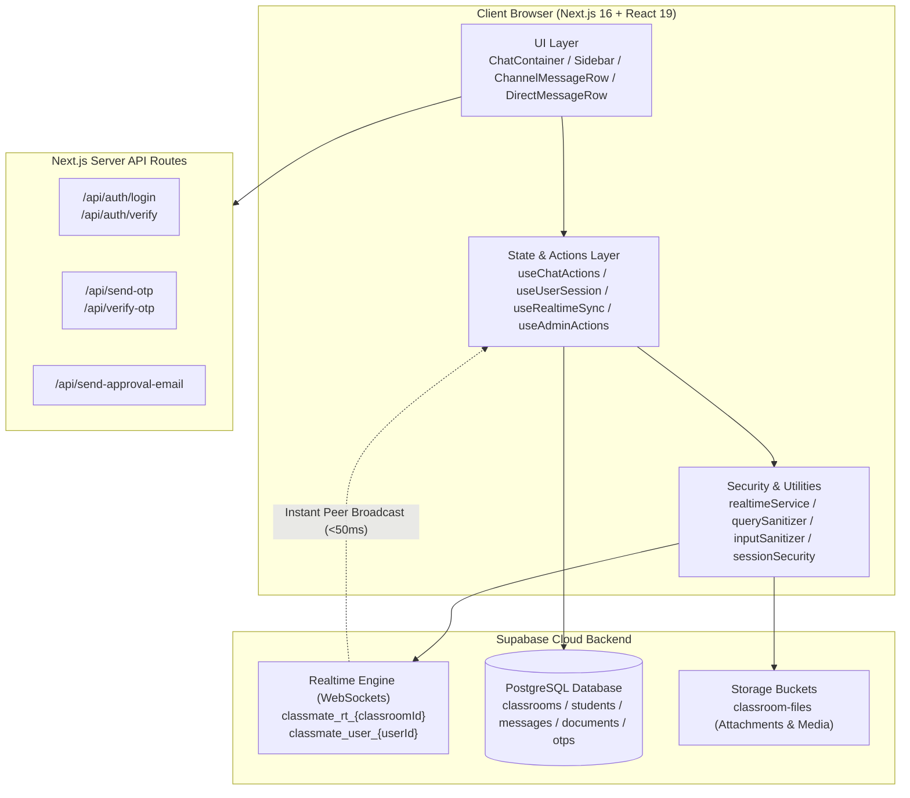

# Classmate — Open-Source Academic Workspace & Campus Note Vault

[](https://opensource.org/licenses/MIT)
[-black)](https://nextjs.org/)
[](https://react.dev/)
[](https://www.typescriptlang.org/)
[](https://supabase.com/)
[](tests/)

> **A strictly private, closed-network academic workspace and real-time collaboration hub built exclusively for classrooms, study cohorts, and student communities.**

---

## 🏛️ System Architecture



---

## 🚀 Complete Step-by-Step Setup Guide

Follow this guide to get Classmate running locally or deploy it to production.

### Prerequisites
Before starting, ensure you have:
1. **Node.js**: Version `18.18.0` or higher (`20.x` or `22.x` recommended).
2. **Package Manager**: `npm` (included with Node), `pnpm`, or `yarn`.
3. **Supabase Account**: A free account at [supabase.com](https://supabase.com).
4. **SMTP Service (Optional)**: Gmail App Password, Resend, or Brevo for email OTP verification and student approval notices.

---

### Step 1: Clone the Repository
```bash
git clone https://github.com/Nothing-dot-exe/klassmates.git
cd classmate
```

---

### Step 2: Install Dependencies
```bash
npm install
```

---

### Step 3: Set Up Supabase Database & Realtime

1. Log in to [Supabase Dashboard](https://supabase.com/dashboard) and create a **New Project** (e.g., `classmate-vault`).
2. Once provisioned, navigate to the **SQL Editor** tab on the left sidebar.
3. Open [`supabase_schema.sql`](supabase_schema.sql) from the repository root, copy its entire contents, paste it into the Supabase SQL editor, and click **Run**.
   - This automatically creates the required tables: `classrooms`, `students`, `messages`, `documents`, `pending_requests`, `password_reset_requests`, and `email_otps`.
   - It sets up performance indexes and security constraints.
4. **Enable Realtime**:
   - Go to **Database** -> **Replication**.
   - Ensure the following tables are enabled for `supabase_realtime`:
     - `messages`
     - `students`
     - `pending_requests`
     - `password_reset_requests`
     - `classrooms`
5. **Set Up Storage Bucket**:
   - Go to **Storage** -> **Create a new bucket**.
   - Name it: `classroom-files`.
   - Set it to **Public** (or configure authenticated access policies).

---

### Step 4: Configure Environment Variables

Create a file named `.env.local` in the project root:

```env
# ==========================================
# 1. SUPABASE DATABASE & REALTIME
# ==========================================
NEXT_PUBLIC_SUPABASE_URL=https://your-project-ref.supabase.co
NEXT_PUBLIC_SUPABASE_ANON_KEY=your-supabase-anon-key
SUPABASE_SERVICE_ROLE_KEY=your-supabase-service-role-key

# ==========================================
# 2. CRYPTOGRAPHIC SESSION SECURITY
# ==========================================
# Generates tamper-proof HMAC-SHA256 session signatures
SESSION_SIGNING_SECRET=your_super_secret_signing_key_min_32_characters_long

# ==========================================
# 3. SMTP CONFIGURATION (Optional / Recommended)
# For sending 6-digit email OTPs and student admission credentials
# ==========================================
SMTP_HOST=smtp.gmail.com
SMTP_PORT=587
SMTP_SECURE=false
SMTP_USER=your-email@gmail.com
SMTP_PASS=your-16-character-gmail-app-password
SMTP_FROM="Classmate Vault <no-reply@classmate.edu>"
```

> [!TIP]
> You can retrieve your Supabase credentials under **Project Settings** -> **API** in the Supabase dashboard.

---

### Step 5: Run the Development Server

Start the Next.js Turbopack development server:
```bash
npm run dev
```

*On Windows, you can also double-click [`run.bat`](run.bat).*

Open your browser and navigate to:
**[http://localhost:3000](http://localhost:3000)**

---

### Step 6: Deploying to Vercel (Production)

1. Push your repository to your GitHub account:
   ```bash
   git push origin main
   ```
2. Log in to [Vercel](https://vercel.com) and click **"Add New Project"**.
3. Import your `klassmates` repository.
4. In the **Environment Variables** section, add the same variables from your `.env.local`:
   - `NEXT_PUBLIC_SUPABASE_URL`
   - `NEXT_PUBLIC_SUPABASE_ANON_KEY`
   - `SUPABASE_SERVICE_ROLE_KEY`
   - `SESSION_SIGNING_SECRET`
   - `SMTP_HOST`, `SMTP_PORT`, `SMTP_USER`, `SMTP_PASS`, `SMTP_FROM`
5. Click **Deploy**. Vercel will build and launch the site within ~60 seconds.

---

## 🧪 Testing & Quality Assurance

Classmate includes a 64-test automated regression suite covering RBAC authorization, IDOR boundaries, PostgREST filter injection, camera photo gating, and 30-student real-world workflows.

### Run All Tests
```bash
npm test
```

Expected output:
```
▶ Authentication: Server-Side Login Flow & Credential Protection (2 tests) - PASSED
▶ Authentication: No Hardcoded Backdoors & Roll-number Passwords (1 test) - PASSED
▶ Authentication: Cryptographic Session Security & Anti-Tampering (4 tests) - PASSED
▶ Authentication: OTP Verification IP Rate Limiting (3 tests) - PASSED
▶ IDOR & Chat Authorization: Message and Channel Isolation (4 tests) - PASSED
▶ IDOR & Privacy Isolation: Direct Message (DM) Boundaries (3 tests) - PASSED
▶ IDOR & Deletion Permissions: Strict Permission Matrix (6 tests) - PASSED
▶ Input Validation: Camera Photo Validation (Photos Only) (4 tests) - PASSED
▶ Input Validation: Chat Message & Profile Payload Sanitization (4 tests) - PASSED
▶ Input Validation: PostgREST Filter Injection Prevention (6 tests) - PASSED
▶ Input Validation & XSS: URL Sanitization & Protocol Validation (2 tests) - PASSED
▶ Real-World Integration Test: 30-Student Classroom Lifecycle & Workflows (9 tests) - PASSED
▶ RBAC: Admin Actions Hook Gating & Privilege Isolation (5 tests) - PASSED
▶ RBAC: Admin Privilege Gates & Authorization Matrix (3 tests) - PASSED
▶ RBAC: API Route Protection & Privilege Boundaries (3 tests) - PASSED
▶ RBAC: Mass Assignment & Over-Posting Protection (2 tests) - PASSED
▶ WebSockets & Real-Time: Broadcast Event Anti-Spoofing & Privilege Protection (2 tests) - PASSED
▶ WebSockets & Real-Time: PII Stripping from Broadcasts (1 test) - PASSED

ℹ tests 64
ℹ suites 20
ℹ pass 64
ℹ fail 0
```

### Static Type Checking & Production Build
```bash
# Verify TypeScript strict typing
npx tsc --noEmit

# Test optimized Next.js Turbopack build
npm run build
```

---

## 📚 Master Documentation Index

Detailed technical specifications, security audit ledgers, and database models are stored under **[`docs/`](docs/)**:

| Document | Focus & Scope | Key Raw Implementation Files |
| :--- | :--- | :--- |
| **[1. Authentication & Login](docs/AUTHENTICATION_AND_LOGIN.md)** | Student sign-in, Classroom Join Gate, Admin PIN gate, HMAC-SHA256 session tokens, and presence tracking. | [`src/hooks/useUserSession.ts`](src/hooks/useUserSession.ts)<br/>[`src/components/modals/JoinGateModal.tsx`](src/components/modals/JoinGateModal.tsx)<br/>[`src/lib/database/studentsDb.ts`](src/lib/database/studentsDb.ts) |
| **[2. Chat & Real-Time Sync Engine](docs/CHAT_AND_REALTIME_SYSTEM.md)** | `#general` social-media layout, 1-on-1 private DMs, WebSocket broadcasting, typing indicators, and reactions. | [`src/hooks/useChatActions.ts`](src/hooks/useChatActions.ts)<br/>[`src/hooks/useRealtimeSync.ts`](src/hooks/useRealtimeSync.ts)<br/>[`src/lib/realtimeService.ts`](src/lib/realtimeService.ts)<br/>[`src/components/chat/ChannelMessageRow.tsx`](src/components/chat/ChannelMessageRow.tsx) |
| **[3. Message Deletion & Permissions](docs/MESSAGE_DELETION_AND_PERMISSIONS.md)** | "Delete for Me" vs "Delete for Everyone", database hard-deletion (`DELETE FROM messages`), CR moderation rules. | [`src/lib/database/messagesDb.ts`](src/lib/database/messagesDb.ts)<br/>[`src/components/chat/DeleteMessageModal.tsx`](src/components/chat/DeleteMessageModal.tsx)<br/>[`src/lib/chatPermissions.ts`](src/lib/chatPermissions.ts) |
| **[4. Media, Avatars & Storage](docs/MEDIA_STORAGE_AND_AVATARS.md)** | Supabase Storage bucket uploads, native camera photo capture (anti-video gate), and real-time avatar sync. | [`src/components/chat/ChatInput.tsx`](src/components/chat/ChatInput.tsx)<br/>[`src/lib/security/inputSanitizer.ts`](src/lib/security/inputSanitizer.ts)<br/>[`src/lib/avatarUtils.ts`](src/lib/avatarUtils.ts) |
| **[5. Security Architecture & Data Isolation](docs/SECURITY_AND_DATA_ISOLATION.md)** | Closed-room boundary, query-level DM isolation, PostgREST filter injection protection, and rate limiting. | [`src/lib/security/querySanitizer.ts`](src/lib/security/querySanitizer.ts)<br/>[`src/lib/security/sessionSecurity.ts`](src/lib/security/sessionSecurity.ts)<br/>[`src/lib/database/messagesDb.ts`](src/lib/database/messagesDb.ts) |
| **[6. Database Schema & Data Models](docs/DATABASE_SCHEMA_AND_MODELS.md)** | PostgreSQL relational schema, indexes, RLS policies, tables, and TypeScript interfaces. | [`supabase_schema.sql`](supabase_schema.sql)<br/>[`src/types/index.ts`](src/types/index.ts) |
| **[7. Privacy Architecture Audit](docs/PRIVACY.md)** | Open-source data protection audit, zero-data-monetization policy, and audit trail. | [`src/components/modals/JoinGateModal.tsx`](src/components/modals/JoinGateModal.tsx)<br/>[`src/lib/database/messagesDb.ts`](src/lib/database/messagesDb.ts) |

---

## 🛡️ Security & Carrier-Grade Isolation Highlights

- **Admin vs. User Boundaries**: Centralized `isAuthorizedAdmin()` gate enforcement ensures students cannot trigger approvals, classroom updates, or password resets.
- **Strict Message Deletion Matrix**:
  - In group channels: Author and Class Representative (Admin) can delete for everyone.
  - In private 1-on-1 DMs: **Only the author can delete for everyone**. The recipient (even if an Admin) can only delete for themselves.
  - Channel-wide clear is restricted strictly to room administrators.
- **PostgREST Injection Neutralization**: All user query inputs pass through [`querySanitizer.ts`](src/lib/security/querySanitizer.ts) to strip clause-injection meta-characters (`,`, `(`, `)`, `:`, `%`, `*`).
- **Anti-Brute-Force Rate Limiting**: Sliding-window IP rate limiting on `/api/verify-otp` (15/5 min) and `/api/auth/login` (10/5 min) stops automated credential attacks.
- **Native Camera Photo Capture**: Mobile-optimized photo capture with direct environment camera triggering and strict rejection of videos and executable files.

---

## 🤝 Contributing

We welcome contributions from the open-source community!

1. **Fork the Repository**: Click "Fork" on GitHub.
2. **Create a Feature Branch**:
   ```bash
   git checkout -b feature/amazing-feature
   ```
3. **Follow Code Quality Rules**:
   - Maintain 100% test pass rate (`npm test`).
   - Run type checks (`npx tsc --noEmit`).
   - Follow strict authorization and input sanitization practices.
4. **Commit Changes**:
   ```bash
   git commit -m "feat: Add amazing new capability"
   ```
5. **Open a Pull Request**: Submit a PR to `main` with a clear description of your changes.

---

## 📄 License

This project is licensed under the **MIT License** — see the [LICENSE](LICENSE) file for details. Free to use, modify, distribute, and self-host for academic institutions worldwide.
