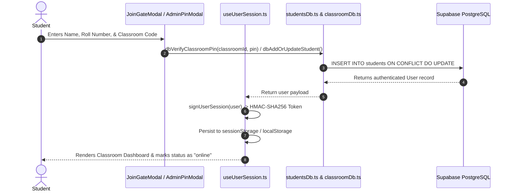

# Authentication, Login & Session Lifecycle

This document explains the technical implementation of student enrollment, classroom sign-in, Class Representative (CR) / Admin privilege elevation, session tokens, and online/offline status tracking.

---

## 1. Authentication Flow Overview



---

## 2. Key Components & Raw Files

### A. Student Enrollment & Joining
* 📁 **Raw File**: [`src/components/modals/JoinGateModal.tsx`](../src/components/modals/JoinGateModal.tsx)
* **How it works**:
  1. Validates that the student entered their **Full Name**, **Roll Number** (or Email), and a valid **Classroom Code** (e.g. `CS101`).
  2. If the user marks "Remember me on this device", credentials are saved to `localStorage`.
  3. If "Remember me" is unchecked (e.g., in a public lab computer), session data is stored only in `sessionStorage` and destroyed once the browser tab closes.

### B. Admin & Class Representative (CR) Verification
* 📁 **Raw File**: [`src/components/modals/AdminPinModal.tsx`](../src/components/modals/AdminPinModal.tsx)
* 📁 **Raw File**: [`src/lib/database/classroomDb.ts`](../src/lib/database/classroomDb.ts) (`dbVerifyClassroomPin`)
* **How it works**:
  * Classroom owners configure an administrative PIN or password.
  * When a user requests admin actions (e.g. roster management, deleting other students' messages, editing channel settings), `AdminPinModal` prompts for the security PIN.
  * Verified admin sessions write to `sessionStorage.getItem('classmate_admin_session')`, preventing accidental permanent privilege escalation on shared devices.

### C. Session Management & Cryptographic Signatures
* 📁 **Raw File**: [`src/hooks/useUserSession.ts`](../src/hooks/useUserSession.ts)
* 📁 **Raw File**: [`src/lib/security/sessionSecurity.ts`](../src/lib/security/sessionSecurity.ts)
* **Raw Code Reference**:
```typescript
// From src/hooks/useUserSession.ts:
const handleLogin = (user: User, rememberMe = true) => {
  const userWithStatus: User = { ...user, status: 'online' };
  setCurrentUser(userWithStatus);

  // Generate cryptographic session signature (HMAC-SHA256)
  const token = signUserSession(userWithStatus);

  if (rememberMe) {
    localStorage.setItem('classmate_current_user', JSON.stringify(userWithStatus));
    localStorage.setItem('classmate_session_token', token);
  } else {
    sessionStorage.setItem('classmate_current_user', JSON.stringify(userWithStatus));
    sessionStorage.setItem('classmate_session_token', token);
  }

  // Update online status in database
  dbUpdateStudentStatus(user.id, 'online', classroom.id);
};
```

---

## 3. Online / Offline Presence Tracking

Classmate tracks whether students are active or inactive without requiring third-party telemetry services.

### A. Lifecycle Hooks
1. **On Mount / Tab Focus**:
   * Status is updated to `'online'` in the database via `dbUpdateStudentStatus(user.id, 'online')`.
   * The presence change is broadcasted across the classroom WebSocket channel via `broadcastStudentUpdated`.
2. **On Tab Close / Window Unload (`beforeunload`)**:
   * A navigator beacon or synchronous fetch updates status to `'offline'`.
   * If a student closes their laptop without an explicit logout, a stale session prune marks users inactive if `last_seen_at` exceeds the inactivity threshold.
3. **UI Visual Indicators**:
   * Active users display a glowing emerald green dot (`bg-emerald-500 ring-emerald-500/20`).
   * Offline users display a soft red or subtle neutral dot (`bg-rose-500`).
   * 📁 **Raw File**: [`src/components/layout/SidebarDirectMessages.tsx`](../src/components/layout/SidebarDirectMessages.tsx)

```tsx
{/* Status Dot in Sidebar */}
<span
  className={`absolute -bottom-0.5 -right-0.5 w-2.5 h-2.5 rounded-full ring-2 ring-white dark:ring-zinc-950 ${
    student.status === 'online'
      ? 'bg-emerald-500 shadow-[0_0_6px_rgba(16,185,129,0.4)]'
      : 'bg-rose-500 shadow-[0_0_6px_rgba(244,63,94,0.4)]'
  }`}
  title={student.status === 'online' ? 'Online' : 'Offline'}
/>
```

---

## 4. Reset & Logout Modes

* **Standard Logout**: Clears user tokens, resets status to `'offline'` in PostgreSQL, and returns to the join screen.
* **Instant URL Hard Reset**:
  * Appending `?reset=true`, `?fresh=true`, or `?logout=true` to the URL triggers `useUserSession.ts` to immediately purge `localStorage`, `sessionStorage`, and query strings, ensuring a clean slate for demonstrations or multi-user shared machines.
