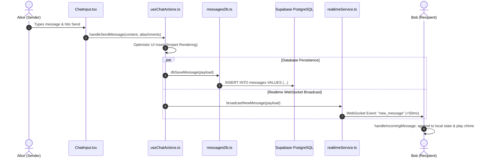

# Chat & Real-Time Sync Engine

This document details the real-time messaging pipeline, WebSocket protocols, visual bubble layout architecture, direct message isolation, and synchronization.

---

## 1. Message Dispatch Pipeline



---

## 2. Channel Messages vs 1-on-1 Direct Messages

Classmate differentiates between public classroom discussions and private student chats:

| Feature | Group Channels (`#general`) | Direct Messages (DMs) |
| :--- | :--- | :--- |
| **Visibility Scope** | Entire classroom | Strictly between Author & Recipient |
| **WebSocket Channel** | `classmate_rt_{classroomId}` | `classmate_user_{recipientId}` |
| **Database Query** | `eq('channel_id', 'chn_general')` | `or(and(sender, recipient), and(recipient, sender))` |
| **Visual Header** | Sender Avatar, Name, CR 👑 Badge, Roll # | Recipient Profile Banner with Online Status |
| **Deletion Rules** | Author can delete; Class Rep / Admin can moderate | Author can delete; Recipient cannot delete for Author |

---

## 3. Social Media Bubble Layout Architecture

Messages adopt a modern, intuitive messaging app design (like WhatsApp, Telegram, iMessage) implemented in:
* 📁 **Group Channels**: [`src/components/chat/ChannelMessageRow.tsx`](../src/components/chat/ChannelMessageRow.tsx)
* 📁 **Direct Messages**: [`src/components/chat/DirectMessageRow.tsx`](../src/components/chat/DirectMessageRow.tsx)

### A. Sent Messages (`isMine === true`)
* **Alignment**: Aligned to the **right side** (`justify-end`, `items-end`).
* **Bubble Appearance**: Premium gradient (`bg-gradient-to-r from-indigo-600 via-indigo-700 to-purple-700 text-white shadow-md rounded-2xl rounded-tr-xs`).
* **Avatar**: Hidden for the sender to keep the feed clean.
* **Micro-Footer**: Integrated timestamp, TLS encryption lock icon, and mobile action trigger (`•••`) right inside the bubble.

### B. Received Messages (`isMine === false`)
* **Alignment**: Aligned to the **left side** (`justify-start`, `items-start`).
* **Avatar**: Sender's circular avatar on the far left with profile view trigger.
* **Header**: Sender Name in indigo, Class Rep crown badge (`👑 Class Rep`), and Roll Number (`#CS-42`).
* **Bubble Appearance**: High-contrast neutral card (`bg-[#FAF7FD] dark:bg-[#121214] border border-[#DFD3E7] dark:border-[#27272a] text-zinc-950 dark:text-zinc-100 rounded-2xl rounded-tl-xs`).

### C. Raw Code Excerpt: Message Row Structure
```tsx
// From src/components/chat/ChannelMessageRow.tsx
export const ChannelMessageRow: React.FC<ChannelMessageRowProps> = ({
  message,
  currentUserId,
  isFirst = true,
  ...
}) => {
  const isMine = Boolean(message.senderId === currentUserId);

  return (
    <div className={`group relative flex w-full ${isMine ? 'justify-end' : 'justify-start'}`}>
      {/* Left Avatar for Classmates */}
      {!isMine && isFirst && (
        
      )}

      {/* Bubble Container */}
      <div className={`flex flex-col max-w-[85%] ${isMine ? 'items-end' : 'items-start'}`}>
        {!isMine && isFirst && (
          <div className="flex items-center gap-1.5 mb-1">
            <span className="text-xs font-bold text-indigo-600">{senderDisplayName}</span>
            {isCRSender && <span className="text-[9px] font-bold">👑 Class Rep</span>}
          </div>
        )}

        <div className={isMine ? 'bg-indigo-600 text-white' : 'bg-white dark:bg-zinc-900'}>
          <MessageContentRenderer content={message.content} isMine={isMine} />
        </div>
      </div>
    </div>
  );
};
```

---

## 4. Real-Time WebSocket Infrastructure

All real-time communication is managed through Supabase Realtime Channels in [`src/lib/realtimeService.ts`](../src/lib/realtimeService.ts) and listened to in [`src/hooks/useRealtimeSync.ts`](../src/hooks/useRealtimeSync.ts).

### A. Broadcast Events & Payload Types
1. **`new_message`**: Dispatches new messages. In DMs, this is broadcasted exclusively on the recipient's private channel (`classmate_user_{userId}`).
2. **`message_deleted`**: Notifies all connected clients that a message ID was purged so their local arrays filter it out instantly.
3. **`typing_indicator`**: Broadcasts `isTyping: boolean` when a user enters text, debounced to prevent network flood.
4. **`message_reaction`**: Updates emoji reactions (👍, ❤️, 💡, 🔥, 🎯, 🚀) across clients.
5. **`student_updated`**: Broadcasts changes to student profiles, nicknames, and avatar URLs.

### B. Raw Code Excerpt: Realtime Channels
```typescript
// From src/lib/realtimeService.ts:
export function getRealtimeChannel(classroomId?: string): RealtimeChannel | null {
  const targetRoom = classroomId || 'default';
  activeChannel = supabase.channel(`classmate_rt_${targetRoom}`, {
    config: { broadcast: { self: false } }, // Prevents redundant echo to sender
  });
  return activeChannel;
}

export function getUserRealtimeChannel(userId?: string): RealtimeChannel | null {
  activeUserChannel = supabase.channel(`classmate_user_${userId}`, {
    config: { broadcast: { self: false } },
  });
  return activeUserChannel;
}
```

---

## 5. Unread Badges & Notifications

* 📁 **Raw File**: [`src/components/layout/SidebarDirectMessages.tsx`](../src/components/layout/SidebarDirectMessages.tsx)
* 📁 **Raw File**: [`src/components/common/IncomingMessageToast.tsx`](../src/components/common/IncomingMessageToast.tsx)
* **Unread Calculation**:
  * The system compares `lastReadTimestamps[userId]` against each message's `timestamp`.
  * If a message is newer than the last recorded read timestamp, an active badge pill (`bg-indigo-600 text-white`) displays the unread count in the sidebar.
  * When a classmate opens the conversation, the timestamp updates immediately, clearing the unread counter.
