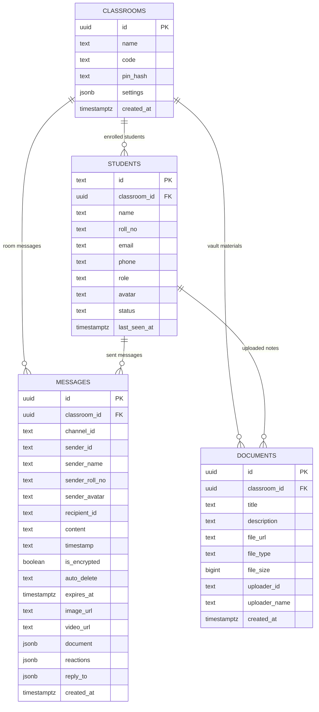

# Database Schema, Relational Architecture & Models

This document describes the PostgreSQL database schema, table structures, indexes, and TypeScript model mappings used in Classmate.

* 📁 **Canonical SQL Schema**: [`supabase_schema.sql`](../supabase_schema.sql)
* 📁 **TypeScript Type Definitions**: [`src/types/index.ts`](../src/types/index.ts)

---

## 1. Relational Entity Relationship Diagram (ERD)



---

## 2. Table Specifications

### A. `classrooms`
Stores top-level virtual classroom metadata.
```sql
CREATE TABLE classrooms (
  id UUID PRIMARY KEY DEFAULT gen_random_uuid(),
  name TEXT NOT NULL,
  code TEXT UNIQUE NOT NULL,
  pin_hash TEXT,
  settings JSONB DEFAULT '{}'::jsonb,
  created_at TIMESTAMPTZ DEFAULT NOW()
);
```

### B. `students`
Stores enrolled students and Class Representatives.
```sql
CREATE TABLE students (
  id TEXT PRIMARY KEY,
  classroom_id UUID REFERENCES classrooms(id) ON DELETE CASCADE,
  name TEXT NOT NULL,
  roll_no TEXT,
  email TEXT,
  phone TEXT,
  role TEXT DEFAULT 'student' CHECK (role IN ('student', 'admin', 'cr')),
  avatar TEXT,
  status TEXT DEFAULT 'offline' CHECK (status IN ('online', 'offline')),
  last_seen_at TIMESTAMPTZ DEFAULT NOW(),
  created_at TIMESTAMPTZ DEFAULT NOW()
);
```

### C. `messages`
Stores channel discussions and private direct messages.
```sql
CREATE TABLE messages (
  id UUID PRIMARY KEY DEFAULT gen_random_uuid(),
  classroom_id UUID REFERENCES classrooms(id) ON DELETE CASCADE,
  channel_id TEXT,             -- Nullable: present for group channels like 'chn_general'
  sender_id TEXT NOT NULL,
  sender_name TEXT NOT NULL,
  sender_roll_no TEXT,
  sender_avatar TEXT,
  recipient_id TEXT,          -- Nullable: present for 1-on-1 private DMs
  content TEXT,
  timestamp TEXT NOT NULL,
  is_encrypted BOOLEAN DEFAULT false,
  auto_delete TEXT DEFAULT 'off',
  expires_at TIMESTAMPTZ,
  image_url TEXT,
  video_url TEXT,
  document JSONB,
  reactions JSONB DEFAULT '[]'::jsonb,
  reply_to JSONB,
  created_at TIMESTAMPTZ DEFAULT NOW()
);
```

### D. `documents`
Stores syllabus materials, lecture slides, and past exam questions in the Document Hub.
```sql
CREATE TABLE documents (
  id UUID PRIMARY KEY DEFAULT gen_random_uuid(),
  classroom_id UUID REFERENCES classrooms(id) ON DELETE CASCADE,
  title TEXT NOT NULL,
  description TEXT,
  file_url TEXT NOT NULL,
  file_type TEXT NOT NULL,
  file_size BIGINT,
  uploader_id TEXT NOT NULL,
  uploader_name TEXT NOT NULL,
  created_at TIMESTAMPTZ DEFAULT NOW()
);
```

---

## 3. High-Performance Indexes

To ensure instant message retrieval and real-time delivery even with thousands of records, the following composite indexes are applied:

```sql
-- Fast lookup for channel chats
CREATE INDEX idx_messages_classroom_channel
  ON messages (classroom_id, channel_id, created_at);

-- Fast lookup for 1-on-1 direct messages
CREATE INDEX idx_messages_dm_lookup
  ON messages (classroom_id, sender_id, recipient_id, created_at);

-- Fast pruning of expired self-destructing messages
CREATE INDEX idx_messages_expired
  ON messages (classroom_id, expires_at)
  WHERE expires_at IS NOT NULL;

-- Fast student presence and roster lookups
CREATE INDEX idx_students_classroom
  ON students (classroom_id, role, status);
```

---

## 4. TypeScript Model Alignment

All database tables directly serialize and deserialize to TypeScript interfaces defined in [`src/types/index.ts`](../src/types/index.ts).

```typescript
// From src/types/index.ts:
export interface ChatMessage {
  id: string;
  senderId: string;
  senderName: string;
  senderRollNo?: string;
  senderAvatar?: string;
  content: string;
  timestamp: string;
  channelId?: string;
  recipientId?: string;
  isEncrypted?: boolean;
  autoDelete?: string;
  expiresAt?: string;
  imageUrl?: string;
  videoUrl?: string;
  document?: DocumentItem;
  reactions?: MessageReaction[];
  replyTo?: {
    id: string;
    senderName: string;
    content: string;
    imageUrl?: string;
  };
}
```
