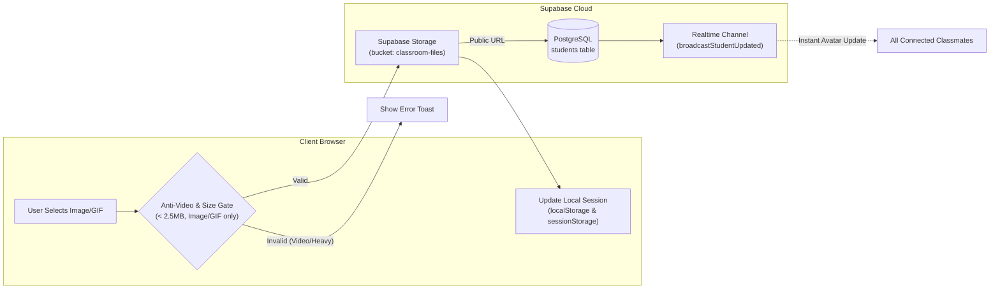

# Media Storage, Avatars & Attachment Architecture

This document covers file uploads, avatar validation, the anti-video gate, Supabase Storage integration, and real-time profile picture synchronization.

---

## 1. Overview of File & Media Handling

Classmate allows students to share study notes, images, PDF slide decks, and custom profile avatars. To maintain performance, prevent database bloat, and secure student privacy, all media follows strict validation and storage pipelines.



---

## 2. Avatar Validation & Anti-Video Gate

* 📁 **Raw File**: [`src/components/modals/profile/AvatarPickerSection.tsx`](../src/components/modals/profile/AvatarPickerSection.tsx)
* **The Problem**: If users link long video streams or upload heavy video files as profile pictures, database sizes explode, data transfer limits are exhausted, and chat rendering stalls.
* **The Solution**: An active validation gate checks MIME types, file extensions, URL patterns, and byte sizes.

### A. Supported & Rejected Media Types
* ✅ **Allowed**: Static images (`PNG`, `JPEG`, `JPG`, `WebP`, `SVG`) and **Animated GIFs** (`GIF`).
* ❌ **Rejected**: Video files (`MP4`, `MOV`, `WebM`, `AVI`, `MKV`) and video hosting URLs (YouTube, Vimeo, TikTok).
* ⚖️ **Size Limit**: Enforced maximum of **2.5 MB** per avatar.

### B. Raw Code: Anti-Video Validation
```typescript
// From src/components/modals/profile/AvatarPickerSection.tsx
const handleFileUpload = async (e: React.ChangeEvent<HTMLInputElement>) => {
  const file = e.target.files?.[0];
  if (!file) return;

  // 1. Enforce strict image & gif policy (block videos)
  if (!file.type.startsWith('image/') || file.type.startsWith('video/')) {
    setError('Only lightweight images and animated GIFs are supported. Videos are not permitted.');
    return;
  }

  // 2. Reject heavy files to protect mobile performance
  if (file.size > 2.5 * 1024 * 1024) {
    setError('Avatar image must be smaller than 2.5MB for fast loading.');
    return;
  }

  // 3. Upload to Supabase Storage
  const publicUrl = await uploadClassroomFile(file, classroomId, 'avatars');
  if (publicUrl) {
    onAvatarChange(publicUrl);
  }
};
```

---

## 3. Real-Time Avatar Synchronization Across Devices

When a student changes their profile photo, the change must appear immediately across all participants' screens without requiring a manual refresh.

### A. Triple-Tier Synchronization
1. **Local Browser State**:
   * Updates `currentUser.avatar` in React state.
   * Mirrors to both `localStorage` and `sessionStorage` in [`src/hooks/useAdminActions.ts`](../src/hooks/useAdminActions.ts) and [`src/hooks/useUserSession.ts`](../src/hooks/useUserSession.ts).
2. **Database Persistence**:
   * Updates `avatar` column in the `students` table via `dbAddOrUpdateStudent`.
3. **WebSocket Realtime Broadcast**:
   * Dispatches `broadcastStudentUpdated` in [`src/lib/realtimeService.ts`](../src/lib/realtimeService.ts).
   * All peers' instances of [`src/hooks/useRealtimeSync.ts`](../src/hooks/useRealtimeSync.ts) listen for `student_updated` events and patch their cached message rows and roster lists.

---

## 4. Deterministic Safe Avatar Fallback

* 📁 **Raw File**: [`src/lib/avatarUtils.ts`](../src/lib/avatarUtils.ts)
* If an avatar URL fails to load, is null, or gets deleted, `getSafeAvatar(avatarUrl, userName)` automatically generates a fallback avatar using deterministic dicebear or initial-based SVG generation.

```typescript
// From src/lib/avatarUtils.ts:
export function getSafeAvatar(avatarUrl?: string | null, userName?: string | null): string {
  if (avatarUrl && avatarUrl.trim() && !avatarUrl.startsWith('blob:')) {
    return avatarUrl;
  }
  const name = userName?.trim() || 'Student';
  return `https://api.dicebear.com/7.x/bottts/svg?seed=${encodeURIComponent(name)}`;
}
```

---

## 5. Course Materials & Academic Document Vault

* 📁 **Raw Files**:
  * [`src/components/documents/DocumentHub.tsx`](../src/components/documents/DocumentHub.tsx)
  * [`src/components/documents/PdfViewerModal.tsx`](../src/components/documents/PdfViewerModal.tsx)
  * [`src/lib/database/documentsDb.ts`](../src/lib/database/documentsDb.ts)
* Notes, syllabus guides, and past exam papers uploaded to the Document Vault are stored in the `documents` table, scoped strictly to `classroom_id`.
* PDFs can be previewed directly inside the integrated reader modal (`PdfViewerModal`) without leaving the workspace.
