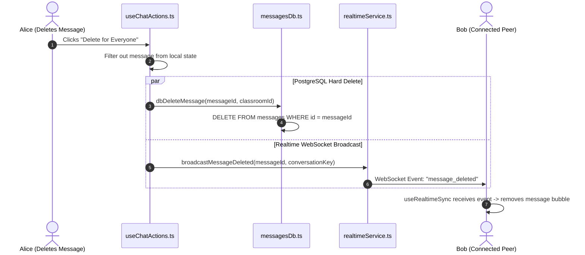

# Message Deletion, Hard-Purge & Permissions

This document describes how message and media deletion operates, detailing permission rules, "Delete for Me" vs "Delete for Everyone", database hard-deletion, and moderation controls.

---

## 1. Deletion Permission Matrix

Classmate implements strict role-based access control (RBAC) to ensure student privacy while maintaining academic moderation capabilities.

| Chat Context | User Role | Can Delete for Me? | Can Delete for Everyone? | Database Impact |
| :--- | :--- | :---: | :---: | :--- |
| **Direct Message (DM)** | Message Author | ✅ Yes | ✅ Yes | Hard `DELETE` from PostgreSQL & all devices |
| **Direct Message (DM)** | Message Recipient | ✅ Yes | ❌ No | Client-side filter (`deleted_for_me`) |
| **Group Channel (`#general`)** | Message Author | ✅ Yes | ✅ Yes | Hard `DELETE` from PostgreSQL & all devices |
| **Group Channel (`#general`)** | Class Rep / Admin | ✅ Yes | ✅ Yes | Hard `DELETE` from PostgreSQL & all devices |
| **Group Channel (`#general`)** | Other Classmates | ✅ Yes | ❌ No | Client-side filter (`deleted_for_me`) |

---

## 2. Deletion Modals & User Experience

### A. The Delete Confirmation Modal
* 📁 **Raw File**: [`src/components/chat/DeleteMessageModal.tsx`](../src/components/chat/DeleteMessageModal.tsx)
* Triggered when a user clicks the trash icon on a message, photo, or via the mobile options menu.
* Provides two options:
  1. **"Delete for Everyone"**:
     * Purges the message from the central database.
     * Broadcasts a WebSocket event so the message is deleted in real-time from all classmates' screens.
  2. **"Delete for Me"**:
     * Hides the message only on the current user's device (saved to local device storage).
     * The message remains visible to the other participant.

```tsx
// From src/components/chat/DeleteMessageModal.tsx
<div className="space-y-2 pt-1">
  {canDeleteForEveryone && (
    <button
      type="button"
      onClick={handleConfirmEveryone}
      className="w-full py-2.5 px-3 rounded-2xl bg-rose-600 hover:bg-rose-700 text-white text-xs font-bold"
    >
      <Trash2 className="w-3.5 h-3.5" />
      <span>Delete for everyone</span>
    </button>
  )}

  <button
    type="button"
    onClick={handleConfirmMe}
    className="w-full py-2.5 px-3 rounded-2xl bg-zinc-100 dark:bg-[#222226] text-xs font-semibold"
  >
    <EyeOff className="w-3.5 h-3.5" />
    <span>Delete for me only</span>
  </button>
</div>
```

---

## 3. Database Hard-Deletion Implementation

* 📁 **Raw File**: [`src/lib/database/messagesDb.ts`](../src/lib/database/messagesDb.ts)
* Unlike many commercial platforms that "soft-delete" (marking `is_deleted = true`), Classmate executes an immediate **hard `DELETE`** operation. Once executed, the message is permanently destroyed and cannot be retrieved.

### A. Raw Code: `dbDeleteMessage`
```typescript
// From src/lib/database/messagesDb.ts:
export const dbDeleteMessage = async (messageId: string, classroomId?: string): Promise<boolean> => {
  if (!isSupabaseConfigured() || !supabase) return false;

  try {
    let query = supabase.from('messages').delete().eq('id', messageId);
    if (classroomId) {
      query = query.eq('classroom_id', classroomId);
    }
    const { error } = await query;
    return !error;
  } catch (err) {
    console.warn('Error deleting message from Supabase:', err);
    return false;
  }
};
```

---

## 4. Real-Time Peer Deletion Sync

When a message is deleted for everyone, the client triggers a real-time event to notify all connected devices.



### A. Raw Code: `broadcastMessageDeleted`
```typescript
// From src/lib/realtimeService.ts:
export function broadcastMessageDeleted(
  messageId: string,
  conversationKey: string,
  classroomId?: string,
  targetRecipientId?: string
) {
  // If in private DM, send on user's private channel
  if (targetRecipientId) {
    const userChannel = getUserRealtimeChannel(targetRecipientId);
    if (userChannel) {
      userChannel.send({
        type: 'broadcast',
        event: 'message_deleted',
        payload: { messageId, conversationKey },
      });
    }
  }

  // Also broadcast to room channel for group conversations
  const roomChannel = getRealtimeChannel(classroomId);
  if (roomChannel) {
    roomChannel.send({
      type: 'broadcast',
      event: 'message_deleted',
      payload: { messageId, conversationKey },
    });
  }
}
```

---

## 5. Media & Photo Deletion

* Photos and videos can be deleted directly from the media preview card without needing to locate a text button.
* 📁 **Raw Files**:
  * [`src/components/chat/ChannelMessageRow.tsx`](../src/components/chat/ChannelMessageRow.tsx)
  * [`src/components/chat/DirectMessageRow.tsx`](../src/components/chat/DirectMessageRow.tsx)
* A high-contrast delete button (`Trash2`) appears on hover (or on mobile tap) directly over the image. Clicking it prompts the delete modal or triggers an instant delete action if permissions permit.

---

## 6. Clear Chat & Export Vault Backup

* 📁 **Raw File**: [`src/components/chat/ClearChatModal.tsx`](../src/components/chat/ClearChatModal.tsx)
* 📁 **Raw File**: [`src/lib/backupExporter.ts`](../src/lib/backupExporter.ts)
* **How it works**:
  * Users or Class Reps who wish to clear chat history are offered a **One-Click JSON Backup** before wiping messages.
  * The export generates a portable JSON file containing messages, timestamps, and attachment references.
  * Calling `dbClearConversationMessages(classroomId, channelId, dmRecipientId, dmSenderId)` purges the selected conversation from the database.
